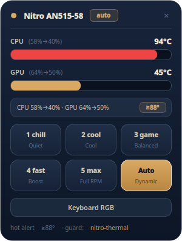
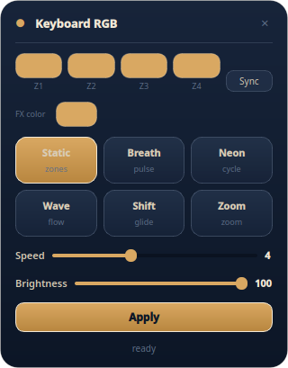

# nitro-control

Fan, thermal & turbo control for the **Acer Nitro AN515-58** on Linux — with a
Fedora-glass **KDE Plasma system-tray widget**.




## Features

- **5 turbo levels + auto** — `chill / cool / game / fast / max` (governor + EPP + turbo)
  and `auto` = thermal guard (≥88°C emergency drop, recovers ≤78°C)
- **System-tray gauge icon** — live temperature ring (HiDPI), color tiers,
  level badge, red pulse while the guard is tripped
- **Glass popup applet** (left-click) — CPU/GPU temp bars, live fan duties,
  6 level buttons; plain menu on right-click
- **Keyboard RGB panel** (popup button / right-click menu) — 4 zone colors,
  6 effects, speed + brightness, glass UI
- **RGB survives reboot & suspend** — state saved to
  `~/.config/nitro-control/rgb.json`, re-applied at login
  (`nitro-rgb-restore.service`) and on resume (`system-sleep` hook)
- **Smooth fan curve** — nbfc custom curve, 7 °C hysteresis, silent at idle
- **Autostart via systemd** — one launch mechanism, single-instance lock,
  lazy windows (popup/RGB created once — no idle cost, no leaks)

## Layout

```
bin/                  turbo-lvl, nitro-thermal-guard, nitro-tray,
                      nitro-rgb-restore launchers
nitro_tray/           Python package (PySide6)
  config.py           tunables: thresholds, level definitions, paths
  sensors.py          coretemp / nvidia-smi / nbfc readers
  control.py          read & apply performance level
  rgb.py              facer device protocol + state persistence (CLI)
  theme.py            Fedora-glass palette + Qt stylesheet
  icon.py             tray gauge icon
  widgets.py          LevelButton
  popup.py            glass popup applet (fan control)
  rgb_panel.py        glass RGB panel
  tray.py             tray icon, menu, popup/RGB launcher, hot pulse
  app.py              entrypoint (lockfile, QApplication)
systemd/              nitro-thermal, nitro-tray, nitro-rgb-restore services
                      + system-sleep/nitro-rgb resume hook
nbfc/                 fan-curve config for nbfc
docs/screenshot.png
install.sh
```

## Install

```bash
sudo dnf install nbfc python3-pyside6   # prerequisites (Fedora)
./install.sh
```

Requires: `nbfc` (fan control), `python3-pyside6`, fonts
*Plus Jakarta Sans* + *JetBrains Mono* for the exact widget look.

## Usage

```bash
turbo-lvl 1        # chill  (powersave / power / turbo off)
turbo-lvl 2        # cool
turbo-lvl 3        # game   (balanced, turbo on)
turbo-lvl 4        # fast
turbo-lvl 5        # max    (performance / performance / turbo on)
turbo-lvl auto     # thermal guard on
```

- **Left-click** tray icon → glass popup (levels, temps, fans, **Keyboard RGB**)
- **Right-click** → menu (levels, open panel, RGB panel, quit)
- Inside the popup: keys **1–5** switch levels, **A** = auto, **Esc** closes
- RGB state applies instantly in the panel; it is remembered across
  reboot/suspend automatically

Fan curve lives in `nbfc/Acer-Nitro-AN515-58.json`
(sensor: CPU fan ← `coretemp`, GPU fan ← `acpitz`, poll 2000 ms).

## Uninstall

```bash
sudo systemctl disable --now nitro-thermal
systemctl --user disable --now nitro-tray
sudo rm /usr/local/bin/nitro-thermal-guard ~/.local/bin/turbo-lvl \
        ~/.local/bin/nitro-tray /etc/systemd/system/nitro-thermal.service \
        ~/.config/systemd/user/nitro-tray.service
rm -rf ~/.local/share/nitro-control
```

## Thanks

Built on [nbfc-linux](https://github.com/nbclyke/nbfc-linux) (fan EC access)
and PySide6. MIT — see [LICENSE](LICENSE).
